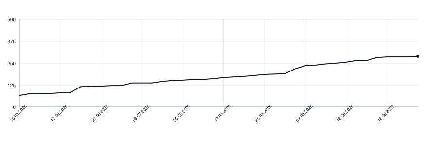

# wikilayer-skills

Audit and translate any [Wikilayer](https://wikilayer.org) wiki from Claude Code or Codex. Three skills: `lint` and `review` are advisory (they recommend, never edit); `translations` also writes, filling a wiki's missing translations.

The two advisory skills split by what a finding costs. Nothing lint reports can become false, so it is fixed in passing; everything review reports can, so the page is read again after the author has acted.

- **`wikilayer:lint`**: the text. Marks, link wording, voice, a block that lost its thread, words that say nothing. Cheap, run before every release.
- **`wikilayer:review`**: the tree and the claims. Where each node sits, what a title promises against what its body holds, bodies restating what the engine already keeps, contradictions across pages, page size and reachability. Expensive, run quarterly or before major releases.
- **`wikilayer:translations`**: cross-language parity. Audits coverage and fills the missing translations for a target language. Writes to the wiki, so it follows the authoring rules like any other edit.

Connect the Wikilayer MCP server at `https://wikilayer.org/mcp` before using the skills.

## Claude Code

```bash
claude plugin marketplace add wikilayer/skills
claude plugin install wikilayer@wikilayer
```

Invoke a skill as `/wikilayer:lint`, `/wikilayer:review`, or `/wikilayer:translations`.

Update it with:

```bash
claude plugin marketplace update wikilayer
claude plugin update wikilayer@wikilayer
```

Run `/reload-plugins` to update an open session.

## Codex

```bash
codex mcp add wikilayer --url https://wikilayer.org/mcp
codex mcp login wikilayer
codex plugin marketplace add wikilayer/skills
codex plugin add wikilayer@wikilayer
```

Start a new Codex session, then invoke a skill as `$wikilayer:lint`, `$wikilayer:review`, or `$wikilayer:translations`.

For local development, use the repository path instead of `wikilayer/skills`:

```bash
codex plugin marketplace add /path/to/wikilayer-skills
codex plugin add wikilayer@wikilayer
```

## Lines of Code

<picture>
  <source media="(prefers-color-scheme: dark)" srcset=".github/loc-history-dark.svg">
  <source media="(prefers-color-scheme: light)" srcset=".github/loc-history-light.svg">
  
</picture>
